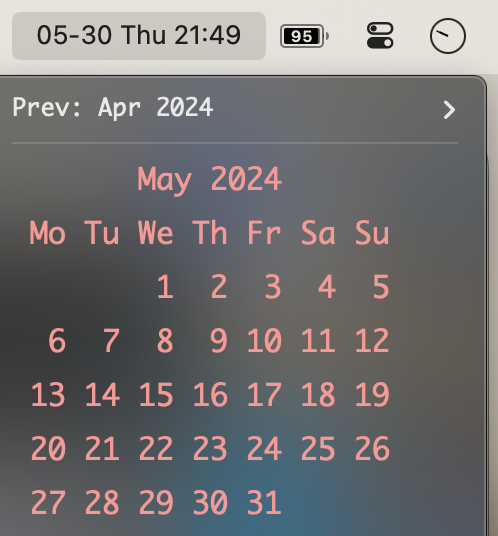

# DateTimeCal
This is a plugin for [xbar](https://github.com/matryer/xbar) to quickly show in your macOS menu bar the current date and time, along with a calendar of the current month in the drop-down menu.

